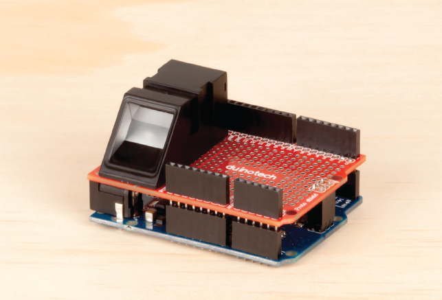
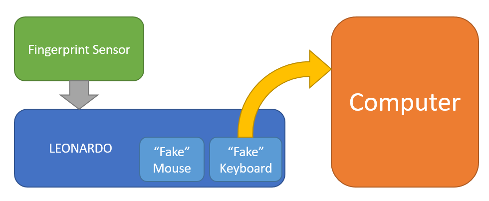

# Fingerprint Login

Sick of typing in your password every day when working or studying from home?
Use our completely extensible fingerprint login system!

Using the Leonardo main board and our fingerprint sensor, you will be able to log in to your computer with only a thumb-print. What's more, you can also assign any of your other fingers to any amount of keyboard or mouse macros and have complete control of your computer right at your fingerprints! We've left plenty of space on the prototyping board so you can put more stuff on, such as additional buttons, LEDs, or maybe even a small joystick to control your mouse through the Arduino `Keyboard` and `Mouse` libraries.

## Table of contents

- [Fingerprint Login](#Fingerprint-Login)
  - [Table of contents](#Table-of-contents)
  - [Bill of materials](#Bill-of-materials)
  - [Optional Extras](#Optional-Extras)
  - [System Overview](#System-Overview)

## Bill of materials

| Qty | Code     | Description                       |
| --- | -------- | --------------------------------- |
| 1   | [XC4430](https://jaycar.com.au/p/XC4430) | Arduino Leonardo compatible board |
| 1   | [XC4482](https://jaycar.com.au/p/XC4482) | Prototyping shield                |
| 1   | [XC4636](https://jaycar.com.au/p/XC4636) | Fingerprint sensor module         |

## Optional Extras

- [XC4422](https://jaycar.com.au/p/XC4422) Joystick Controller
  - Attach the X/Y values to move your mouse around on the screen, and click down to press.
- [AB3459](https://jaycar.com.au/p/AB3459) Feedback Buzzer
  - Alert on password or thumbprint failure, to deter others trying to use your device
- [XC4602](https://jaycar.com.au/p/XC4602) Extended Keypad
  - Use the Keypad to extend up to 16 more buttons to assign to your computer macros, such as writing emails or even macros in computer games
- [XC3732](https://jaycar.com.au/p/XC3732) Tilt sensor
  - Connect up the tilt sensor into your favourite game so that you can tilt the module around to move through virtual worlds.

## System Overview

This project is pretty easy to do; w

