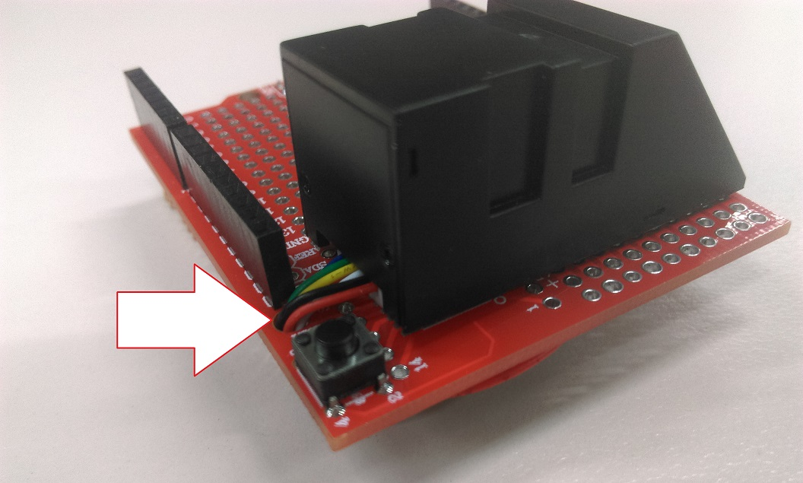

# Fingerprint Login

Sick of typing in your password every day when working or studying from home?
Use our completely extensible fingerprint login system!

Using the Leonardo main board and our fingerprint sensor, you will be able to log in to your computer with only a thumb-print. What's more, you can also assign any of your other fingers to any amount of keyboard or mouse macros and have complete control of your computer right at your fingerprints! We've left plenty of space on the prototyping board so you can put more stuff on, such as additional buttons, LEDs, or maybe even a small joystick to control your mouse through the Arduino `Keyboard` and `Mouse` libraries.


## Table of contents

- [Fingerprint Login](#Fingerprint-Login)
  - [Table of contents](#Table-of-contents)
  - [Bill of materials](#Bill-of-materials)
  - [Optional Extras](#Optional-Extras)
  - [System Overview](#System-Overview)
  - [Assembly](#Assembly)
  - [Using and source code](#Using-and-source-code)
  - [Improvements](#Improvements)

## Bill of materials

| Qty | Code                                     | Description                       |
| --- | ---------------------------------------- | --------------------------------- |
| 1   | [XC4430](https://jaycar.com.au/p/XC4430) | Arduino Leonardo compatible board |
| 1   | [XC4482](https://jaycar.com.au/p/XC4482) | Prototyping shield                |
| 1   | [XC4636](https://jaycar.com.au/p/XC4636) | Fingerprint sensor module         |

## Optional Extras

- [XC4422](https://jaycar.com.au/p/XC4422) Joystick Controller
  - Attach the X/Y values to move your mouse around on the screen, and click down to press.
- [AB3459](https://jaycar.com.au/p/AB3459) Feedback Buzzer
  - Alert on password or thumbprint failure, to deter others trying to use your device
- [XC4602](https://jaycar.com.au/p/XC4602) Extended Keypad
  - Use the Keypad to extend up to 16 more buttons to assign to your computer macros, such as writing emails or even macros in computer games
- [XC3732](https://jaycar.com.au/p/XC3732) Tilt sensor
  - Connect up the tilt sensor into your favourite game so that you can tilt the module around to move through virtual worlds.

## System Overview

This project is pretty easy to do; The Leonardo type boards have an inbuilt USB port that is native to the chip, this means that the boards can show up to the computer as a Keyboard or Mouse (or both). We make use of this via connecting our fingerprint sensor to the board, so that when we press our fingerprint, it will type out the password on the computer.


This is just shown as a proof of concept and can not be used in proper security applications. Whenever the finger is scanned, it will type out the password, which can be a problem if you have a chat program open or someone has opened notepad on your machine without you realising.

With the modules and expansions you can easily change the leonardo board to do many things, such as control the mouse with a joystick or tilt sensor.

## Assembly

The assembly is straight forward; If we get around the odd colour choices, the pinout of the module is as such:


| Colour | Used for    | Connection                                           |
| ------ | ----------- | ---------------------------------------------------- |
| Red    | Ground      | Connect to ground                                    |
| Black  | TX          | Signal out from the sensor to the arduino            |
| White  | RX          | Receive commands from the arduino                    |
| Yellow | 3.3v        | Power the module                                     |
| Green  | Detect out  | This will be `HIGH` when the sensor detects a finger |
| Blue   | Detect 3.3v | Power for the detection circuit above, needs 3.3v    |

You can bunch these wires together and fit them down the screw-hole next to the reset button on the prototyping shield if you want to keep the top of the shield tidy, then simply solder and hot glue (if available) underneath.



When soldering, make sure that both the `BLUE` and `YELLOW` wires are both going to the 3.3v connection. It will not work (best case) or even fry your sensor (worst case) when connected into the 5v connection.

| Colour | Arduino pin            |
| ------ | ---------------------- |
| Red    | GND                    |
| Black  | Pin 1                  |
| White  | Pin 0                  |
| Yellow | 3.3v                   |
| Green  | Pin 2 _(not required)_ |
| Blue   | 3.3v                   |

Strip and wind both the blue and yellow wires together to make it easier to keep them both in the same solder joint.


You can see here that we have soldered the green `detect` wire to pin2. This could go to any pin and is not actually required in the code, as the module is completely controlled via the serial commands. You could snip and ignore this if you want to, but the blue `detect 3.3v` line does have to be connected to power.

## Using and source code

The code is provided in a few folders:

- `enrol` is for binding new fingers to IDs. you would use this sketch to bind IDs to your fingers
- `password` is the code to detect the ID, and type in the password

<notice>

It is worth mentioning again: **This is not secure** and relies on having your password in plain text on the arduino.

You will have to run the `enrol` sketch first in order to assign an ID to one of your fingers, then use the id in the `password` sketch.


After a finger has been enrolled, open the password sketch and put the correct ID and password:

```cpp
//choose the id for your finger from the enrol example
#define FINGER_LOGIN_ID 5
// your computer password
#define PASSWORD "qwerty"
```

Try it out: upload the `password.ino` sketch onto your leonardo, lock the computer, and scan the finger tied to the ID that you placed in the sketch. you should find that your system logs you in. If it doesn't, try opening up the serial monitor to see what it says.

## Improvements

You might have noticed that we have some suggested products to go with this project; As we are using the Leonardo board, we can emulate both a mouse and keyboard for the computer whenever the module is used. For example, with the joystick module:

| Joystick | Leonardo connection |
| -------- | ------------------- |
| X        | A0                  |
| Y        | A1                  |
| Btn      | A2                  |

This is a more condensed version of the arduino IDE example, but you can see the general premise of what's going on and where it could fit into the fingerprint login project.

```cpp
#include <Mouse.h>
void setup()
{
  /* ... set pin modes ...  */
  Mouse.begin();
}

void loop()
{

  //joystick button pressed?
  if (digitalRead(A2) == LOW)
    Mouse.press(MOUSE_LEFT);
  else
    Mouse.release(MOUSE_LEFT);

  int xReading = readAxis(A0);
  int yReading = readAxis(A1);

  Mouse.move(xReading, yReading, 0);

  delay(10);
}
//check the Arduino Examples > USB > Mouse > Joystick for a more correct solution
int readAxis(int pin)
{
  int reading = map(analogRead(pin), 0, 1023, 0, 12);
  int distance = reading - 6;
  if (abs(distance) < 3)
    distance = 0;

  return distance;
}
```
